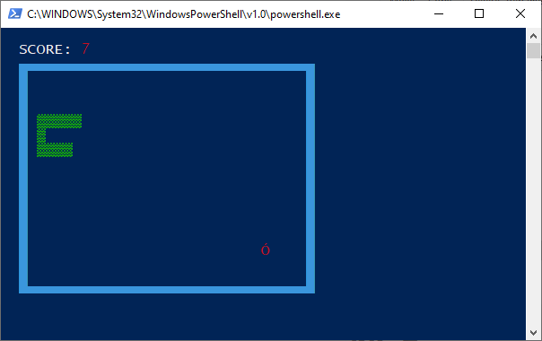

# console-snake
A project to create a snake game in the powershell

## Requirements
### core:
 - python3 (required).

### pips (required):
- colorama 0.4.4 (or compatible)
- pytimedinput 2.0.1 (or compatible)

## Installation
You can download python3 [here](https://www.python.org/downloads/) if you don't have
it installed. If you do, simply run `run.bat` or `run.ps1`.